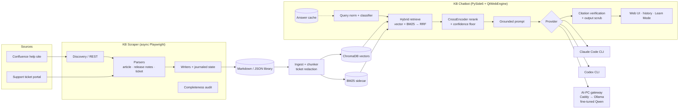

# Knowledge Base Assistant

> From a Confluence help site and a support-ticket portal to a private, locally-run AI support assistant: scraper, markdown library, hybrid RAG, cited answers, and a choice of Claude, ChatGPT or an on-prem model.


## Overview

A support team had its product knowledge split across two places: a **Confluence help site**
(40+ spaces for five product lines) and a **support-ticket portal**, where years of fixes sat
in ticket resolutions. Answering a customer question meant searching both by hand.

This repo holds the whole pipeline that fixes that. It started as a release-notes scraper
and grew, over about 360 commits in six weeks, into two desktop apps:

| App | What it does |
|-----|--------------|
| **KB Scraper** | Crawls the help site (articles and release-note tables) and the ticket portal (fields, comments, resolutions, attachments) with Playwright. It writes a clean, incremental **markdown/JSON library**. |
| **KB Chatbot ("KB Guru")** | A desktop RAG assistant over that library. Hybrid **vector + BM25** retrieval, **cross-encoder reranking** and **grounded answers with verified citations**, through Claude, ChatGPT or an **on-prem fine-tuned model**. |

All product, company and people names in this repo are fictional placeholders (Contoso,
TradeDesk, SalesHub, FormFlow, Fabrikam and so on). No scraped content, tickets, vector
stores or real evaluation data are included.

## Features

**Scraper**
- **Full-site Confluence crawl.** 40+ spaces are discovered through the REST API and parsed from HTML into markdown with YAML front-matter, screenshots and attachments. Release-note tables go through a universal table parser.
- **Ticket-portal scraping.** Adapters cover a legacy ASP.NET bug tracker and its replacement, an encrypted JS single-page app scraped from the rendered DOM. They capture fields, internal/external comments, email threads, resolutions and files.
- **Async, parallel and crash-resilient.** One login is shared across page-per-worker async Chrome. An adaptive throttle, a circuit breaker, a browser supervisor that recovers from crashes, and a journaled scrape state make a crash lose nothing.
- **Completeness audit.** It compares the discovered article set with what is on disk, so gaps are reported and not left silent.
- **Incremental.** Re-runs fetch only new or changed pages and tickets.

**Chatbot**
- **Hybrid retrieval.** ChromaDB vector search (`all-MiniLM-L6-v2`) plus a BM25 sidecar with domain-synonym expansion, fused by **Reciprocal Rank Fusion**. A **CrossEncoder** reranks the result with a calibrated confidence floor.
- **Citation verification.** Every link in an answer is checked against the retrieved chunks. Links the model made up are removed and replaced with verified suggestions.
- **Tickets as knowledge, with PII redaction.** Ticket problems and resolutions are indexed as redacted chunks. A layered redactor handles names, emails, phones, secrets and credential-shaped tokens, and a secret-probe gate must report zero leaks.
- **Conversation continuity.** Follow-ups that refer back to earlier turns, clarify-once behaviour, query rewriting for short follow-ups, and topic-drift detection.
- **Deterministic answers.** A query classifier (product, issue type, ticket IDs), a persistent answer cache and an explicit answer-shape contract make the same question get the same answer.
- **Three reasoning back-ends.** The Claude Code CLI and the Codex CLI (OAuth, no API keys in the app) and a **Local** provider. Local is an Ollama model behind a Caddy basic-auth gateway on a LAN "AI PC", with keyring-stored per-user credentials.
- **On-prem fine-tuning pipeline.** RAG-aware QLoRA training data (ticket pairs, abstain examples, Claude/Codex distillation) passes a hard PII/secret redaction gate. The pipeline covers QLoRA training, merge to GGUF (Q4_K_M), and an eval gate that only ships a tuned model when quality goes up and abstain safety does not go down.
- **Modern desktop UI.** A QtWebEngine web front-end bridged to Python through QWebChannel, with chat history (search, rename, auto-titles), collapsible sources and chat rails, first-run onboarding, and a password-gated **Learn Mode** that writes expert corrections back into the library.
- **Packaged for non-technical users.** Both apps build to standalone Windows executables with PyInstaller.

## Tech Stack

| Layer | Technology |
|-------|-----------|
| Scraping | Playwright (sync then async, headed/headless Chrome), Confluence REST API, BeautifulSoup/lxml |
| Library | Markdown + JSON with YAML front-matter, index generators |
| Embeddings | sentence-transformers `all-MiniLM-L6-v2` |
| Vector store | ChromaDB (persistent, local) |
| Lexical | rank-bm25 + YAML synonym map, Reciprocal Rank Fusion |
| Reranking | CrossEncoder `ms-marco-MiniLM-L-6-v2` (a `bge-reranker-base` variant was evaluated on a branch) |
| LLMs | Claude (Claude Code CLI / Agent SDK), ChatGPT (Codex CLI), Qwen2.5 via Ollama (on-prem) |
| Fine-tuning | QLoRA (transformers + PEFT + bitsandbytes), llama.cpp GGUF export |
| Gateway | Ollama + Caddy (basic auth, bcrypt), PowerShell provisioning scripts |
| GUI | PySide6: QtWebEngine + QWebChannel (chatbot), Qt widgets (scraper) |
| Packaging | PyInstaller |
| Testing | pytest (800+ tests), fake LLM provider, synthetic HTML fixtures, eval harness (recall@k, MRR) |

## Architecture



## Getting Started

### Prerequisites
- Windows 10/11, Python 3.11+
- For the Claude provider: the [Claude Code CLI](https://claude.com/claude-code), logged in. For ChatGPT: the Codex CLI, logged in. For Local: a reachable reasoning gateway (see `ai_pc/reasoning_gateway/README.md`).
- A Confluence site to scrape. Set `BASE_URL` in `scraper/config.py`.

### Install
```bash
git clone https://github.com/Ark310/knowledge-base-assistant.git
cd knowledge-base-assistant
python -m venv scraper/venv
scraper\venv\Scripts\activate
pip install -r scraper/requirements.txt -r Dev/kb_chatbot/requirements.txt
playwright install chromium
```

### Run
```bash
python -m scraper.app            # KB Scraper GUI (Knowledge Base / Release Notes / Tickets tabs)
python -m Dev.kb_chatbot.gui     # KB Chatbot. Use "Reindex" to build the index from library/
```

### Build executables (optional)
```bash
build_scraper_exe_v404.bat       # scraper  -> dist/
build_chatbot_exe.bat            # chatbot  -> dist/
```
The PyInstaller specs expect a branding icon/logo in `assets/`, which is not shipped. Add your own or remove the `icon=` lines.

### Test
```bash
python -m pytest -q              # scraper + chatbot suites
```
Tests that need captured copies of real help-site pages (not shipped) are skipped automatically.

## Configuration

| Setting | Where | Notes |
|---|---|---|
| Help-site URL, spaces | `scraper/config.py`, `scraper/kb_config.py` | `https://help.contoso.example` is a placeholder |
| Ticket-portal credentials | OS keyring (Windows Credential Manager) | Entered in the Tickets tab. Never written to disk. |
| Provider / model | Chatbot Settings or first-run onboarding | Claude, ChatGPT or Local |
| Local gateway | `ai_pc/reasoning_gateway/reasoning.env.example` → `reasoning.env` | LAN IP, port, model name. Per-user creds in keyring. |
| Learn Mode password | `Dev/kb_chatbot/settings.py` | Placeholder `YOUR_LEARN_PASSWORD_HERE`. Only a PBKDF2 hash is stored. |
| State / index location | `%LOCALAPPDATA%` | Kept off synced folders on purpose (see v3.0.1) |

Scraped content (`library/`), vector stores, chat history and fine-tuning data are gitignored and never committed.

## Project Journey

The history in this repo is the real commit history (dates and messages kept, names sanitized).
Most features went through the same loop: **design spec → implementation plan → TDD tasks → review fixes → live smoke → package**.
You can see it in `docs/superpowers/specs` and `docs/superpowers/plans`.

| Version | When (2026) | What changed |
|---|---|---|
| Scraper v1–v2 | Jun 1 | Release-notes scraper, then a full-site Confluence crawler: 34+ space definitions, REST discovery, HTML → markdown library, Qt GUI |
| Chatbot v2.2–v2.3 | Jun 3 | Local RAG baseline (ChromaDB + MiniLM + CrossEncoder, answers via the Claude Code CLI). `[Title](url)` citations with URL validation, multi-turn history, low-confidence suggestions, uploads, Learn Mode |
| v2.4 | Jun 5 | Contextual retrieval for clarification replies and short follow-ups, token viewer, Sonnet as default |
| v3 retrieval overhaul *(branch)* | Jun 5–9 | Hybrid BM25 + vector with RRF, synonym expansion, **golden-set eval harness** (recall@k, MRR), floor calibration. `bge-reranker-base` raised recall@8 **0.816 → 0.920** but latency went **~3 s → ~34 s** on CPU. It shipped only as a beta build and stays on `dev/kb-chatbot-v3-retrieval-overhaul`. |
| v2.5 | Jun 8–9 | Provider registry: **ChatGPT via Codex CLI** next to Claude, with provider-aware rewrite escalation |
| v2.6 | Jun 9–10 | **Support tickets ingested** as redacted problem + resolution chunks, with a conservative PII redactor |
| v2.7 | Jun 11–12 | Incremental ingest (mtime + size manifest), live indexing panel, versioned exe |
| v2.8 | Jun 12–16 | Ticket chunks show client and team, cite the actual ticket page, **conversation continuity**, chunk-schema versioning |
| Tickets v3.x | Jun 16 | Ticket-portal scraper tab: parallel workers, inline attachments |
| v2.9.1 | Jun 16–18 | Redaction hardening (secret-shape scrubber, multi-token names, sign-offs), parent-document expansion, secret-probe gate |
| v2.9.2 | Jun 18–22 | FormFlow made a first-class product, ticket recency, clarify-once and anti-re-clarify, wider rerank for error questions |
| Scraper v4 | Jun 22–24 | The portal moved to an encrypted SPA. Scraping was rebuilt on the rendered DOM with synthetic, structure-faithful fixtures. |
| Scraper v4.0.1–v4.0.3 | Jun 26–Jul 6 | **Async** engine (shared login, page-per-worker), adaptive throttle, circuit breaker, resource sampler, browser supervisor, journaled state |
| Scraper v4.0.4 | Jul 7 | KB tab brought to parity: async KB engine, 90 s article timeout, **completeness audit** |
| **Chatbot v3.0.1 "KB Guru"** | Jul 7–13 | Accuracy engine (query normalization, deterministic classifier, hybrid BM25 + RRF with stable ties, answer cache, eval harness). New ticket schema, state moved off OneDrive, **Local provider + AI-PC reasoning gateway**, onboarding, QtWebEngine web UI with chat history, and an **on-prem QLoRA fine-tuning pipeline** with a redaction gate and eval ship-gate |

**What didn't work, or changed course**
- *Bigger reranker.* `bge-reranker-base` won on accuracy but was about 10× slower on office CPUs. v3.0.1 brought hybrid retrieval back with the light reranker, and added an answer cache and a classifier for consistency.
- *Portal migration.* The ticket portal's API is end-to-end encrypted, so network scraping was dropped. The scraper reads the rendered DOM, validated against clean captures.
- *OneDrive.* Live state and the Chroma index on a synced folder caused lock and SQLite errors. v3.0.1 moved state to `%LOCALAPPDATA%` with a one-time migration.
- *7B fine-tune.* Qwen2.5-7B thrashed an 8 GB GPU, so the pipeline moved to Qwen2.5-3B-Instruct.
- *Real-data tests.* Early tests depended on real ticket files. They were replaced with committed, PII-free synthetic fixtures.

## 🤖 Built with AI

This project was built by pairing with AI coding agents, mostly **Claude Code**, with **Codex** used for some reviews and spikes.

- **358 commits of real development history** in 6 weeks (Jun 1 – Jul 13, 2026), on `main` and the retrieval-overhaul branch.
- **215 of the 369 original commits (58%)** carried an explicit `Co-Authored-By: Claude` trailer, from Claude Opus 4.8, Sonnet 4.6, Fable 5 and Haiku 4.5. The rest were written in the same sessions without the trailer. In this repo every commit carries it.
- Workflow: the **superpowers** skill set for brainstorming, spec, plan and subagent-driven TDD (**19+ design specs and 35+ implementation plans** in `docs/superpowers/`). **OpenWolf** was used for project memory, a bug log and a file anatomy map. Playwright MCP captured live portal DOM structure, which was then rebuilt as synthetic fixtures.
- Claude Code project memory kept **12 per-version memory notes** (scraper v2 → v4.0.3, chatbot v2.3 → v3.0.1, AI-PC migration). The AI-PC runbook (`AI-PC-MIGRATION.md`) shows how a long Claude Code session was handed off to another machine with its full context.
- The chatbot's providers use the same tools it was built with: the Claude Code CLI and Codex CLI are its answer engines, and Claude/Codex distillation produces fine-tuning targets.
- **812 tests** are collected by pytest, and the suite runs offline with a fake LLM provider.

## License

MIT. See [LICENSE](LICENSE).

## Author

**Abdul Raqeeb Khatri** ([@Ark310](https://github.com/Ark310))
